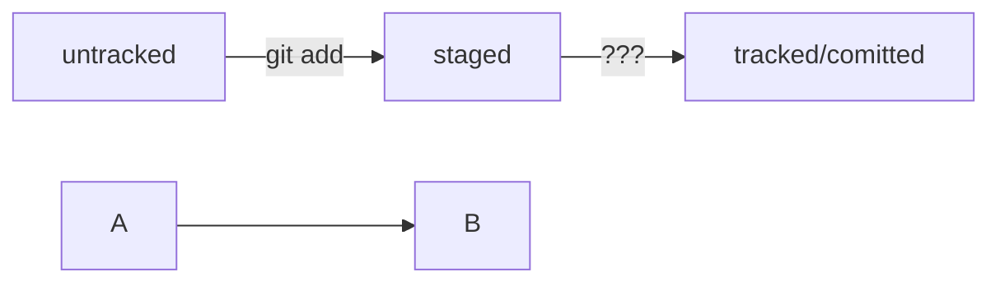

# Полезная шпаргалка по Git

## Навигация.

- *pwd* (от англ. print working directory, «показать рабочую папку») — покажи, в какой я папке;
- *ls* (от англ. list directory contents, «отобразить содержимое директории») — покажи файлы и папки в текущей папке;
- *ls -a* — покажи также скрытые файлы и папки, названия которых начинаются с символа .;
- *cd first-project* (от англ. change directory, «сменить директорию») — перейди в папку first-project;
- *cd first-project/html* — перейди в папку html, которая находится в папке first-project;
- *cd ..* — перейди на уровень выше, в родительскую папку;
- *cd ~* — перейди в домашнюю директорию (/Users/Username);
- *cd /* — перейди в корневую директорию.

## Работа с файлами и папками

### Создание

- *touch index.html* (англ. touch, «коснуться») — создай файл index.html в текущей папке;
- *touch index.html style.css script.js* — если нужно создать сразу несколько файлов, можно напечатать их имена в одну строку через пробел;
- *mkdir second-project* (от англ. make directory, «создать директорию») — создай папку с именем second-project в текущей папке.

### Копирование и перемещение
- *cp file.txt ~/my-dir* (от англ. copy, «копировать») — скопируй файл в другое место;
- *mv file.txt ~/my-dir* (от англ. move, «переместить») — перемести файл или папку в другое место.

### Чтение

- *cat file.txt* (от англ. concatenate and print, «объединить и распечатать») — распечатай содержимое текстового файла file.txt.

### Удаление

- *rm about.html* (от англ. remove, «удалить») — удали файл about.html;
- *rmdir images* (от англ. remove directory, «удалить директорию») — удали папку images;
- *rm -r second-project* (от англ. remove, «удалить» + recursive, «рекурсивный») — удали папку second-project и всё, что она содержит.

### Полезные возможности

Команды необязательно печатать и выполнять по очереди. Можно указать их списком — разделить двумя амперсандами (&&).

У консоли есть собственная память — буфер с несколькими последними командами. По ним можно перемещаться с помощью клавиш со стрелками вверх (↑) и вниз (↓).

Чтобы не вводить название файла или папки полностью, можно набрать первые символы имени и дважды нажать Tab. Если файл или папка есть в текущей директории, командная строка допишет путь сама.

Например, вы находитесь в папке dev. Начните вводить cd first и дважды нажмите Tab. Если папка first-project есть внутри dev, командная строка автоматически подставит её имя. Останется только нажать Enter.

## Инициализация репозитория

- *git init* (от англ. initialize, «инициализировать») — инициализируй репозиторий.

## Подготовка файла к коммиту

- *git add todo.txt* (от англ. add, «добавить») — подготовь файл todo.txt к коммиту;
- *git add --all* (от англ. add, «добавить» + all, «всё») — подготовь к коммиту сразу все файлы, в которых были изменения, и все новые файлы;
- *git add .* — подготовь к коммиту текущую папку и все файлы в ней.

## Создание коммита

- *git commit -m "Комментарий к коммиту."* (от англ. commit, «совершать», «фиксировать» + message, «сообщение») — сделай коммит и оставь комментарий, чтобы было проще понять, какие изменения внесены. 

## Просмотр информации о коммитах

- *git log (от англ. log, «журнал [записей]»)* — выведи подробную историю коммитов.

## Просмотр состояния файлов

- *git status* (от англ. status, «статус», «состояние») — покажи текущее состояние репозитория.

## Хеш — идентификатор коммита

- *Хеширование* — это способ преобразовать набор данных и получить их «отпечаток» (англ. fingerprint).

Git хеширует (преобразует) инофрмацию о коммите (когда был сделан коммит, содержимое файлов в репозитории на момент коммита и ссылка на предыдущий коммит).

Результат — уникальный для каждого коммита хэш (набор буквенных символов и цифр, основной идентификатор коммита), гарантированно одинаковый для одного и того же набора данных.

Все хеши и таблицу *хеш → информация о коммите* Git сохраняет в служебные файлы. Они находятся в скрытой папке *.git* в репозитории проекта.

## Лог

- *Лог* — список коммитов с их описанием, выводится при помощи команды *git log*.

Описание коммита содержит хеш, информацию об авторе, дате и времени коммита, а также сообщение к нему.

- *Сокращённый лог* — список коммитов с их описанием и сокращённым хешем, выводится при помощи команды *git log --oneline*.

Сокращённый хеш (первые несколько символов полного) можно использовать точно так же, как и полный. 
Для этого команда git log --oneline автоматически подбирает такую длину сокращённых хешей, чтобы они были уникальными в пределах репозитория.

## HEAD

- *Файл HEAD* (англ. «голова», «головной») — один из служебных файлов папки *.git.* Он указывает на последний.

Внутри HEAD — ссылка на служебный файл: *refs/heads/master* (или *refs/heads/main* в зависимости от названия ветки). 
В нём можно увидеть хеш последнего коммита.

Если нужно передать последний коммит, то вместо его хеша можно просто написать слово HEAD — Git поймёт, что вы имели в виду последний коммит.

## Статусы файлов

- *tracked*

Новые файлы в Git-репозитории помечаются как untracked, то есть неотслеживаемые. Git «видит», что такой файл существует, но не следит за изменениями в нём. 
У untracked-файла нет предыдущих версий, зафиксированных в коммитах или через команду git add.

- *staged*

После выполнения команды git add файл попадает в staging area (от англ. stage — «сцена», «этап [процесса]» и area — «область»), то есть в список файлов, которые войдут в коммит. 
В этот момент файл находится в состоянии staged.

- *untracked*

Состояние tracked — это противоположность untracked.
Оно довольно широкое по смыслу: в него попадают файлы, которые уже были зафиксированы с помощью git commit, а также файлы, которые были добавлены в staging area командой git add.
То есть все файлы, в которых Git так или иначе отслеживает изменения.

- *modified*

Состояние modified значит, что Git сравнил содержимое файла с последней сохранённой версией и нашёл отличия.
Например, файл был закоммичен и после этого изменён.

- Для файлов в состояниях staged и modified обычно не указывается, что они также tracked, потому что это состояние подразумевается.

- Команда git add добавляет в staging area только текущее содержимое файла.

# Конец ~филь~ полезной шпаргалки.

